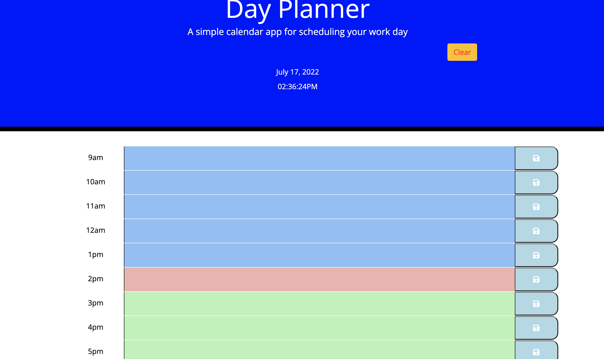

# Work-Day-Scheduler-
Description:

This is a basic day planner app that loops through the hours of 9am - 5pm(typical working hours) for a specific date, which is the current day that the user opens the app. The app uses moment.js to handle time. The app also allows the user to enter and save text into any description field that has a class of future. The data will be saved to the localStorage of the browser. The past hours are highlighted gray, the current hour red, and future hours green.

Narrative:
Create a simple app that uses bootstrap, jquery, moment.js, fontawesome, & google fonts
App is a simple day scheduler of typical working hours in a day.
Follows specific current date of when the user opens the app and use those hours of that day.
Allow the user to save text for each hour and change row color depending if it is a past, present for future hour.
Data of text is to be stored in localStorage of the browser until page is restarted. Refreshed page should still keep the localStorage.

User Story:
AS AN employee with a busy schedule
I WANT to add important events to a daily planner
SO THAT I can manage my time effectively
Acceptance Criteria
GIVEN I am using a daily planner to create a schedule
WHEN I open the planner
THEN the current day is displayed at the top of the calendar
WHEN I scroll down
THEN I am presented with timeblocks for standard business hours
WHEN I view the timeblocks for that day
THEN each timeblock is color coded to indicate whether it is in the past, present, or future
WHEN I click into a timeblock
THEN I can enter an event
WHEN I click the save button for that timeblock
THEN the text for that event is saved in local storage
WHEN I refresh the page
THEN the saved events persist

live URL:
[LiveUrl] ()

Screenshot:

